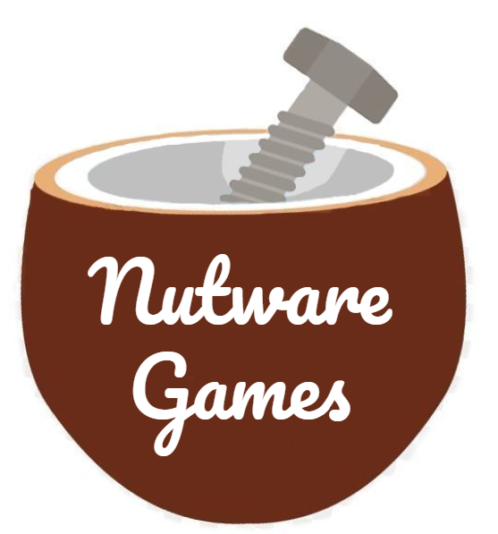
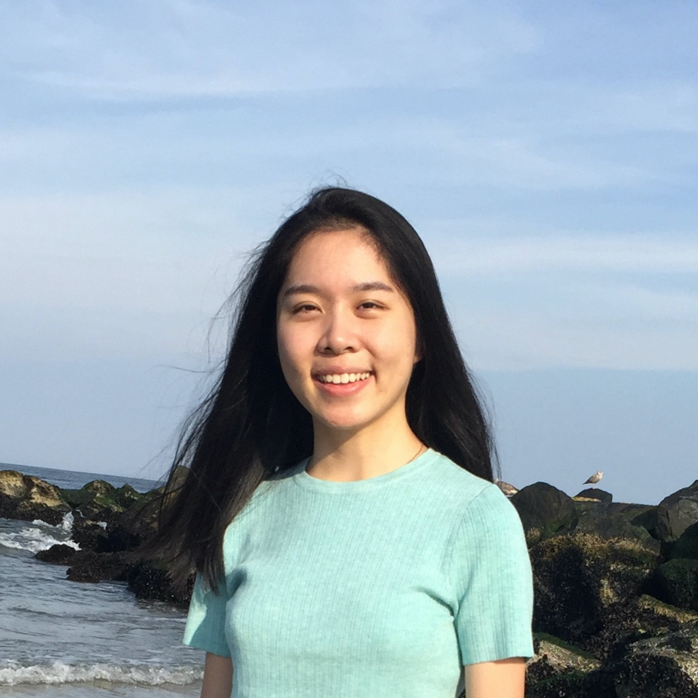
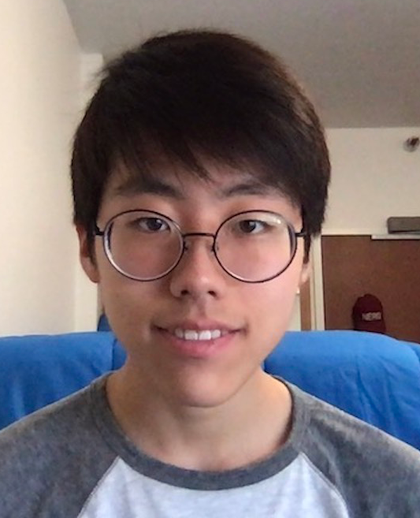

# NUTWARE GAMES

/* Temporary Logo

## Project Synopsis
Nutware Games is the ideal gaming hub for chilling and having fun with your friends

### Team Members

| Member | Photo | Email |
| ------ | ----- | ----- |
| Alina Chou | s | s |

Alina Chou | Chris Kim | Dean Zhou | Edgar Roman | William Wang
:---: | :---: | :---: | :---: | :---:
 |  |  |  | 
alinac@stanford.edu | chankyo@stanford.edu | deanzhou@stanford.edu | emroman@stanford.edu | wjwang@stanford.edu

To get in contact, please e-mail us!

### Project Synopsis
We are currently working on http://www.nuttyarcade.com/, a website that allows you to play tabletop games with your friends (without a paywall :o) 
(and save progress so that you can feel pride and accomplishment for the many hours you waste on our website to support capitalism)!

Games to await for:
- FISH
- <del>COLONIST.IO</del>  PIONEER
- <del>MONOPOLY</del>  CAPITALISM
- TRACTOR

### Team Skills
Member | Skills | Personal Traits | Desired Growth | Weaknesses
--- | --- | --- | --- | ---
Alina | Programming, ML, Software Development | Enjoys learning new things | Web Development | Focuses too much on details
Chris | AI, Programming, LaTeX, GUI, CAD (Solidworks) | Likes writing neat code | Full Stack Web Development | Sporadic Sleep Schedule
Dean | Backend, Integration, Testing | Organized | Computer Networking, Frontend | Needs lots of sleep
Edgar | AI/ML, LaTeX, Programming, Fast Learner | Persistent, Likes to have fun but likes winning even more | Web Development | Tendency to overcommit
William | LaTeX, Python, Mathematical Analysis | Likes Problem Solving | Web Development | Web Development
