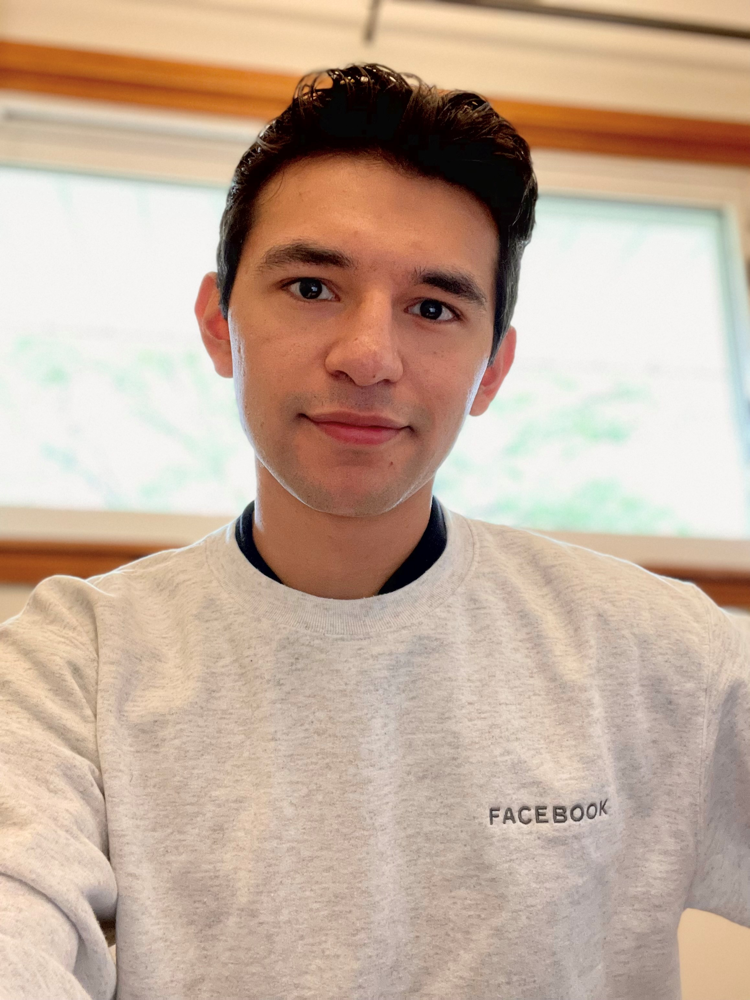

# Team25

### NutWare Incorporated
### Logo
### Meet the Team! xd
Alina Chou | Chris Kim | Dean Zhou | Edgar Roman | William Wang
Photo | Photo | Photo |  | Photo
alinac@stanford.edu | chris.c.kim@stanford.edu | deanzhou@stanford.edu | emroman@stanford.edu | wjwang@stanford.edu

Message our e-mails, also something about having a messenger/text group chat

### Synopsis of Proposed Project
http://www.nuttyarcade.com/
description here
### Team Communication

### Team Skills Matrix
Member | Skills | Personal Traits | Desired Growth | Weaknesses
--- | --- | --- | --- | ---
Alina | User testing, CAD, Statistical Data | Very sensitive to work environment | Programming | Programming
Chris | Aesthetics and layout, building prototypes, AutoCAD | Disciplined | LaTeX, Planning Skills | Painting, Programming, Interpersonal communication
Dean | AI, Machine Learning, Programming, GUI skills | Loves learning new programming languages | MatLAB | bad memory
Edgar | AI/ML, LaTex, Programming, Fast Learner | Persistent, Likes to have fun but likes winning even more | Web Development | Tendency to overcommit
William | LaTeX, Python, Mathematical Analysis | Likes Problem Solving | Web Development | Web Development

### Benchmark, Brainstorm, Need Find
